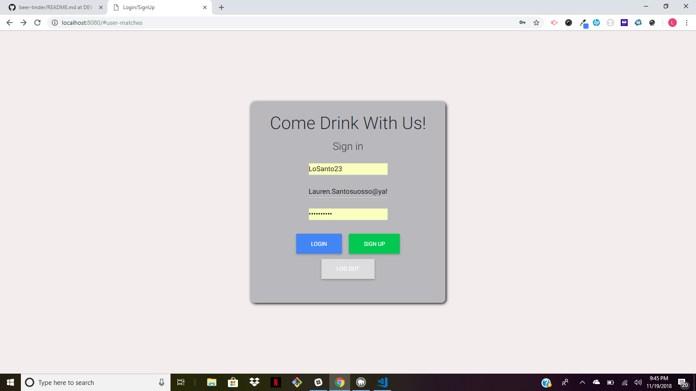
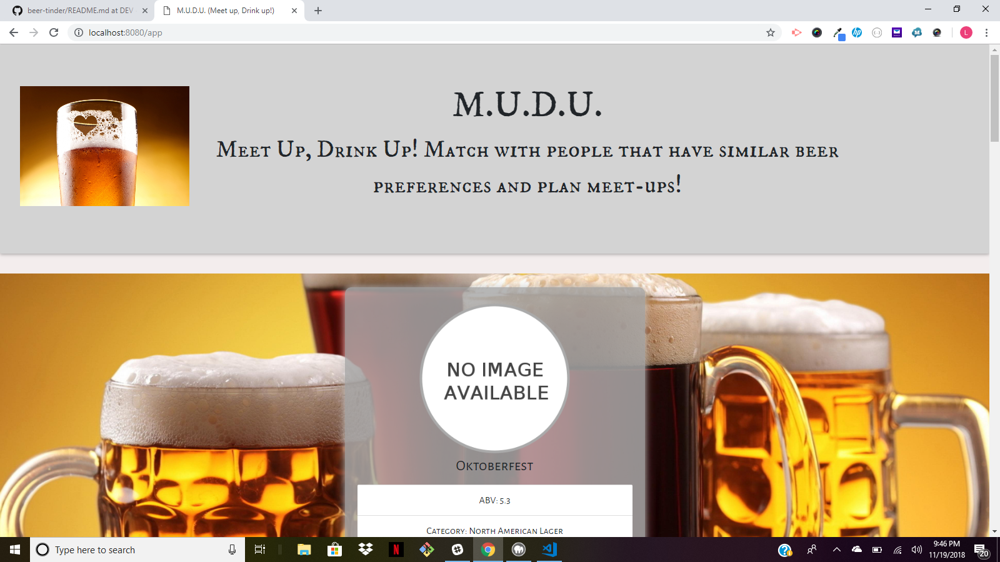
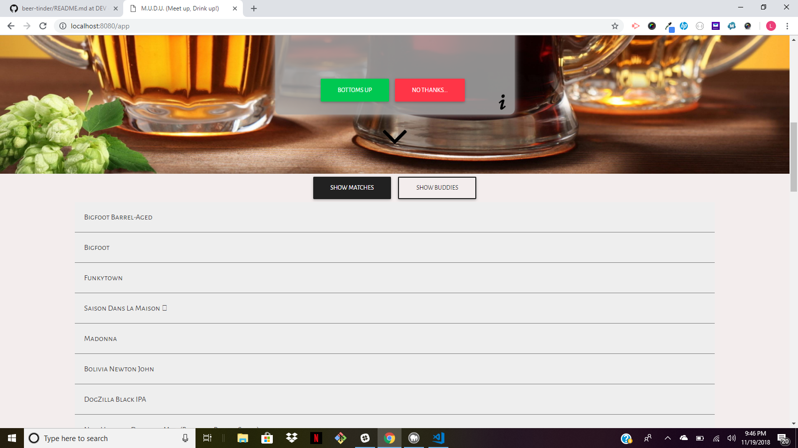
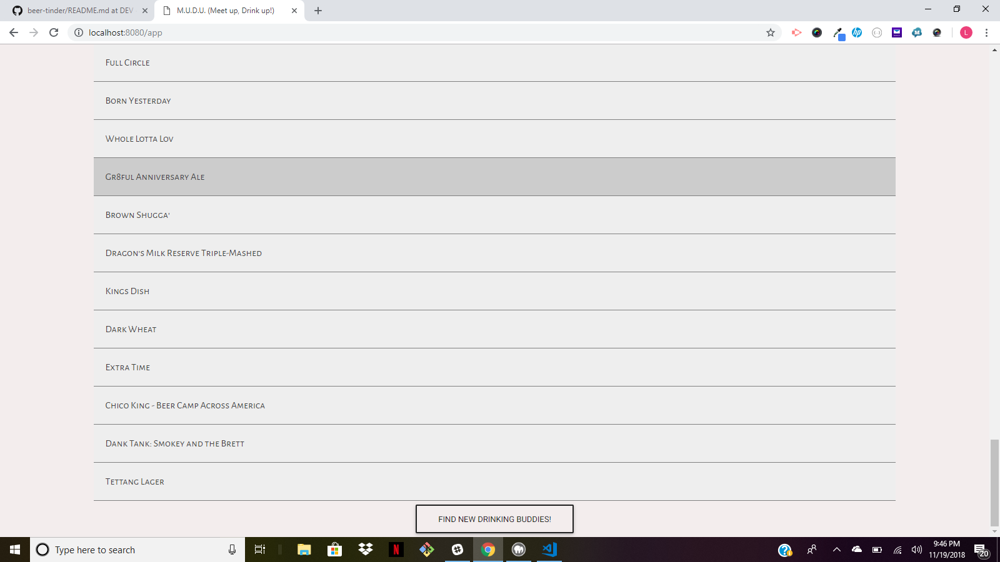

# M.U.D.U (Meet Up, Drink Up!)

## Overview 
This app is similar to Tinder, and uses the Brewery DB API and HERE Maps API to match users based on beer preferences and proximity in location to eachother. M.U.D.U utilizes MySQL, Node & Express Servers, Bootstrap HTML.  It is built following the MVC design pattern and deployed to Heroku.

* M.U.D.U is a matching app that lets users input beer preferences and then matches users with similar preferences and location proximity.

* This app will store user information and matches in a database using MySQL which is hosted with Heroku.

The following NPM Packages are installed to run this app:

* [express](https://www.npmjs.com/package/express)
* [path](https://www.npmjs.com/package/path)
* [request](https://www.npmjs.com/package/request)
* [mysql](https://www.npmjs.com/package/mysql)

### M.U.D.U Site Walkthrough
Upon the page loading, the user has the option of logging in or signing up for M.U.D.U. They must enter a Username, email address and password to sign up. This information is stored using a firebase database.  The user is then brought to the main page.  The top of the apge bears the M.U.D.U. logo and title. There is a message that states "Meet Up, Drink Up! Match with people that have similar beer preferences and plan meet-ups!" Beneath the welcome message the user is presented cards with random beers pulled from the BreweryDB API. They have the option of selecting "bottoms up" if they like the beer and "no thanks" otherwise.  The ABV percentage of the beer and category (i.e. pilsner, IPA) is displayed under an image of the beer label (if available). The card also has an option for information about the beer, by clicking the "i" button on the bottom right the user can access that information. There is an option to "show matches" and "show buddies" under the main card. The page then dynamically displays "matches" which are the beers the user selected as a preference. The "show buddies" button displays user's that have similar beer preferences. 

## Future Goals for M.U.D.U
 We will put our future goals here once we are happy with MVP for application

## Screenshots of Site

### Example of M.U.D.U Login Page 

### Example of M.U.D.U Home Page (Top) 

### Example of M.U.D.U Home Page (Middle) 

### Example of M.U.D.U Home Page (Bottom)

### Link to Video Walkthrough of M.U.D.U Site

(Video walkthrough link will go here)
  
### Link to Deployed M.U.D.U site on Heroku

http://fuchsia-beer-tinder.herokuapp.com/

### Contributors to this Project (Team Fuschia)
Jason Barnett @Jwb81,
Kristian Neely @kneely13,
Lauren Santosuosso @LaurenSantos23,
Will Bursch @willbursch

